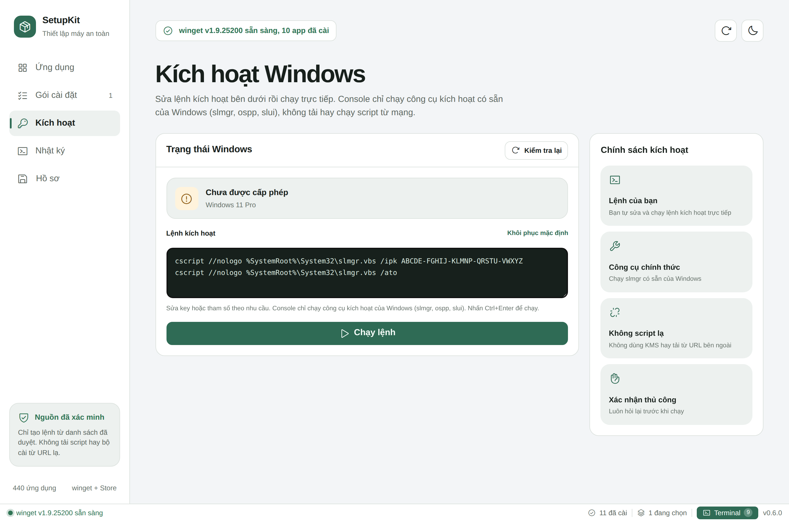
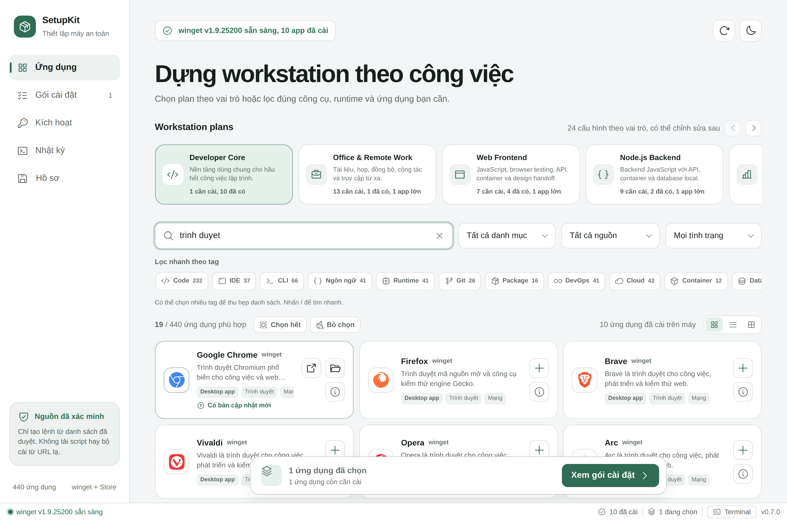

<div align="center">


**Máy Windows mới tinh? Chọn một plan theo công việc của bạn, bấm cài, và đi pha ly cà phê.**


</div>

---

## Cài đặt

**Cách 1 — một dòng lệnh** (mở PowerShell, dán vào, Enter):

```powershell
irm https://raw.githubusercontent.com/TrisMinh/setupkit/main/scripts/install.ps1 | iex
```

Lệnh này tải bản mới nhất từ Releases, đặt vào thư mục ứng dụng của bạn, tạo shortcut ở Start Menu + Desktop và mở app luôn.

**Cách 2 — tải thủ công:** lấy `SetupKit.exe` từ [**Releases**](../../releases/latest) và mở. Không cần cài đặt, không cần runtime nào khác.

> Windows 11 có sẵn WebView2. Windows 10 nếu thiếu, SetupKit sẽ tự đề nghị cài Evergreen Runtime chính thức của Microsoft.

## SetupKit làm được gì?

Cài lại Windows xong thường mất cả buổi mở từng trang web tải từng bộ cài. SetupKit gói toàn bộ việc đó vào một app:

- **440 ứng dụng hợp pháp** từ Windows Package Manager và Microsoft Store — đủ từ trình duyệt, IDE, runtime, database, DevOps tool đến app chat, game launcher; chia 15 nhóm với 34 tag lọc nhanh
- **24 Workstation plan theo vai trò** — Developer Core, Web Frontend, Node.js Backend, Python & AI, Designer, Gaming, Văn phòng... Chọn một plan là có ngay danh sách công cụ được sắp đúng thứ tự cài: nền tảng trước, IDE sau
- **Tự biết máy bạn đã có gì** — quét winget, Registry, Start Menu và shortcut để đánh dấu app đã cài, kèm phiên bản và thư mục cài đặt; app đã có sẽ không bị cài lại
- **Chạy thử trước, cài thật sau** — chế độ mặc định chỉ mô phỏng toàn bộ quá trình, máy không thay đổi gì; muốn cài thật phải bật công tắc riêng và xác nhận từng lệnh
- **Minh bạch từng lệnh** — xem trước chính xác câu lệnh winget của từng app, theo dõi stdout/stderr trực tiếp trong terminal tích hợp khi cài
- **Thanh trạng thái luôn hiện** dưới cùng: tình trạng winget, số app đã cài, số đang chọn và nút mở terminal nhanh
- **Activate Office legit**
- **Chọn nơi cài** cho các package hỗ trợ, mở app hoặc thư mục cài đặt ngay khi cài xong
- **Xuất hồ sơ JSON** — lưu bộ ứng dụng đang chọn để dựng máy tiếp theo y hệt chỉ trong một lần import

## Ảnh màn hình

<div align="center">


*Chọn Workstation plan theo vai trò, hoặc tự lọc trong 440 ứng dụng*
</div>

| | |
|:---:|:---:|
|  |  |
| *Tiến trình từng app + terminal winget trực tiếp* | *Xem lệnh sẽ chạy trước khi đồng ý* |
|  |  |
| *Activate Office legit* | *Tự thích ứng khi thu nhỏ cửa sổ* |
|  |  |
| *Giao diện tối theo hệ thống* | *Tìm nhanh, không cần gõ dấu* |

## Dùng trong 3 bước

1. **Chọn** — bấm một Workstation plan hoặc tự tick từng app trong danh mục
2. **Xem lại** — sang tab Gói cài đặt, kiểm tra danh sách và lệnh của từng app; chạy thử nếu muốn chắc chắn
3. **Cài** — bật "Cài đặt thật", bấm nút và xác nhận; SetupKit chạy winget tuần tự, báo tiến trình từng app và đánh dấu app cài xong

## An toàn là mặc định

SetupKit được thiết kế để **không thể** bị lợi dụng thành công cụ tải phần mềm lạ:

| Lớp bảo vệ | Cụ thể |
|---|---|
| Allowlist nhúng trong binary | Chỉ chấp nhận package ID có trong catalog đã kiểm chứng — không URL ngoài, không script tải về, không installer thủ công |
| Hai nguồn duy nhất | `winget` và `msstore`, đều là kho chính thức có kiểm duyệt của Microsoft |
| Chạy thử mặc định | Mô phỏng không đụng tới máy; cài thật cần bật công tắc **và** xác nhận từng lệnh qua hộp thoại hệ thống |
| Lệnh minh bạch | Mọi lệnh hiển thị đầy đủ trước khi chạy, output ghi lại nguyên văn trong terminal |
| Xác minh sau cài | Quét lại máy để xác nhận trạng thái thật, không tin kết quả suông |

## Build từ mã nguồn

Yêu cầu [Go 1.25+](https://go.dev/dl/) và [Node.js LTS](https://nodejs.org) (Node chỉ dùng lúc build, app chạy không cần).

```powershell
npm run package:win     # validate + test + build -> release/SetupKit.exe
npm run validate        # chỉ kiểm tra catalog, JS, icon, DOM
```

Hoặc double-click `BUILD-SETUPKIT.cmd` ở thư mục cha.

## Cấu trúc dự án

```
setupkit-app/
├── main.go            # bootstrap: nhúng frontend, nạp catalog, mở cửa sổ Wails
├── internal/kit/      # toàn bộ logic Go: chạy winget, quét máy, allowlist
├── frontend/          # toàn bộ giao diện web (embed vào exe)
│   ├── index.html · renderer.js · styles.css
│   ├── catalog.json   # 440 app - file SINH TỰ ĐỘNG
│   └── assets/        # 309 logo SVG + icon Phosphor
├── scripts/           # build catalog, icon, đóng gói, publish, install.ps1
├── docs/              # CHANGELOG, tài liệu catalog, ảnh, release notes
└── build/             # manifest + tài nguyên Windows
```

Muốn thêm/sửa ứng dụng trong catalog: sửa `scripts/build-catalog.js` rồi chạy `npm run catalog:build` — đừng sửa tay `frontend/catalog.json`.

## Giấy phép

Phát hành theo giấy phép [MIT](LICENSE). Lịch sử thay đổi ở [CHANGELOG](docs/CHANGELOG.md).

Logo các ứng dụng thuộc về chủ sở hữu tương ứng (nguồn [Simple Icons](https://simpleicons.org)); icon giao diện từ [Phosphor Icons](https://phosphoricons.com).
