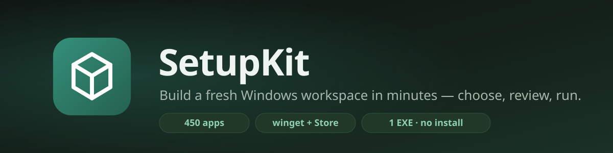
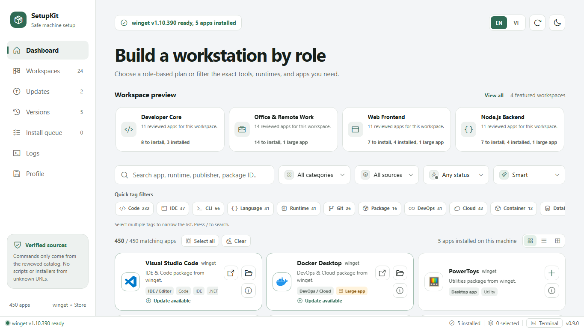
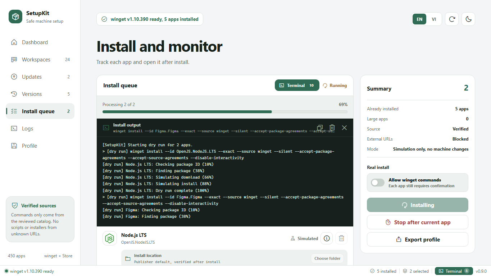
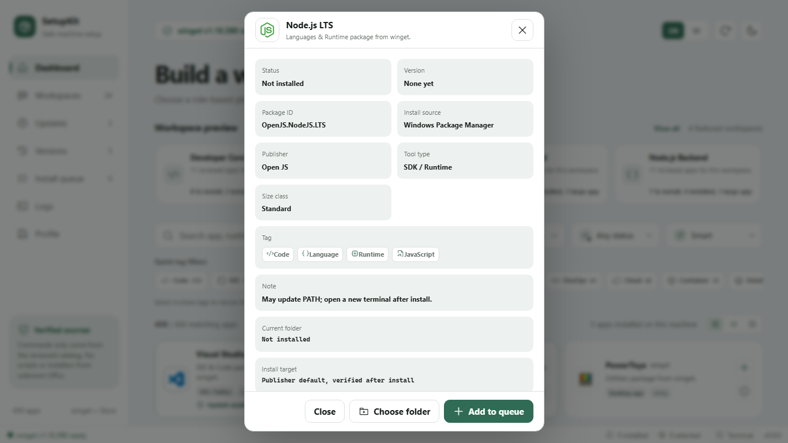
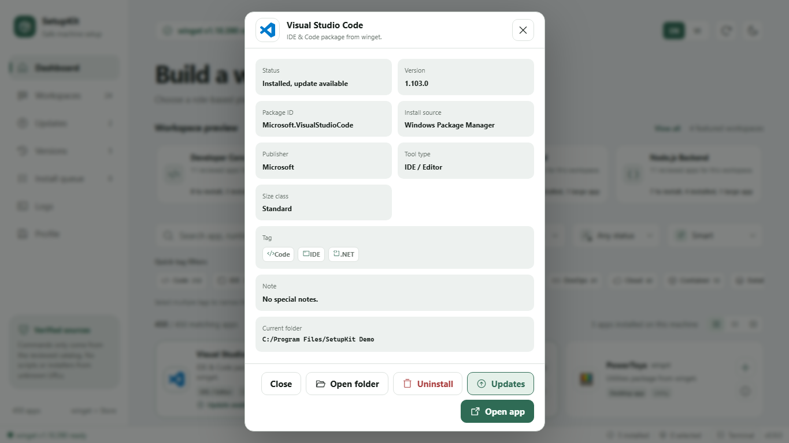
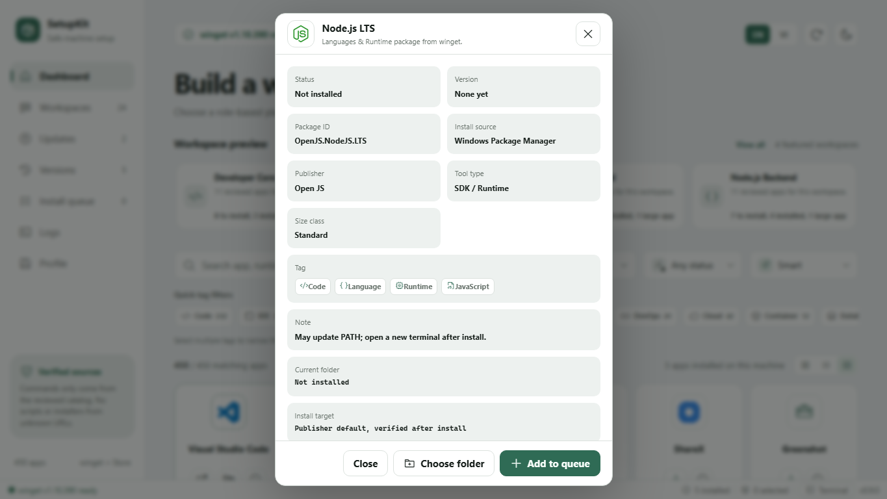
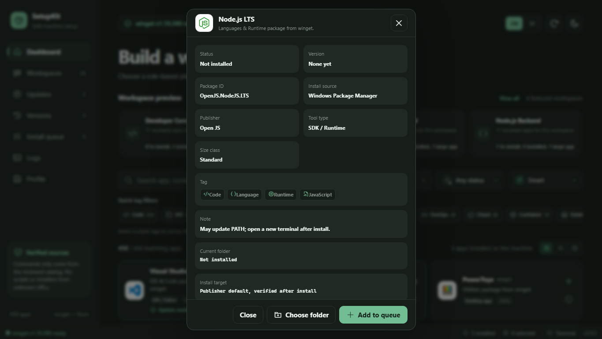
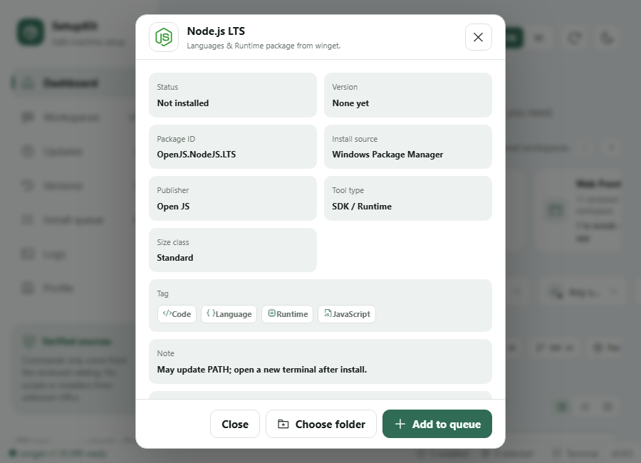

<div align="center">



**Turn a fresh Windows machine into a ready workspace in minutes: choose a role, review the commands, and run only verified packages.**


</div>

---

## Install

**Option 1 - one PowerShell command:**

```powershell
irm https://raw.githubusercontent.com/TrisMinh/setupkit/main/scripts/install.ps1 | iex
```

The script downloads the latest release, places it in your app directory, creates Start Menu and Desktop shortcuts, and launches SetupKit.

**Option 2 - manual download:** grab `SetupKit.exe` from [**Releases**](../../releases/latest) and run it. No installer and no extra runtime are required.

> Windows 11 already includes WebView2. On Windows 10, SetupKit prompts you to install the official Microsoft Evergreen Runtime if it is missing.

## What SetupKit Does

Reinstalling Windows should not mean opening dozens of websites and hunting for installers. SetupKit wraps the boring part in one reviewed app:

- **450 reviewed apps** from Windows Package Manager and Microsoft Store, covering browsers, IDEs, runtimes, databases, VPNs, DevOps tools, chat apps, game launchers, and utilities across 15 groups and 35 quick tags.
- **24 role-based workspaces** such as Developer Core, Web Frontend, Node.js Backend, Python & AI, Product Design, Gaming PC, and Office & Remote Work.
- **Batch install with progress** so you can select many apps, run them in order, stop safely after the current app, and retry only failed apps.
- **Updates inside the app** with a dedicated Updates tab, search, per-app upgrade, and one-confirmation bulk update.
- **Older versions and rollback** through `winget show --versions`, with explicit install or uninstall-then-install modes for reviewed winget packages.
- **Uninstall support** from app details, using `winget uninstall` with a polished in-app confirmation dialog and command preview.
- **Installed app detection** through winget, Registry, Start Menu, and shortcuts, including installed version, install path, and available update state.
- **No auto-select on launch**: every session starts with an empty queue until the user selects apps or a workspace.
- **Import/export profiles** as JSON so a curated app set can be reused on the next machine.
- **Grid, list, and icon views** for browsing the catalog efficiently.
- **Dry run by default**: real installs require enabling real mode and confirming each command.
- **Transparent terminal output** for every winget command.
- **Status bar always visible** with winget state, installed count, selected count, and terminal access.
- **Winget recovery**: if Windows Package Manager is missing, SetupKit can open the Microsoft Store App Installer page.
- **Install location picker** for packages that support custom locations.

## Screenshots

<div align="center">


*Choose a role-based workspace or filter the 450-app catalog manually.*
</div>

| | |
|:---:|:---:|
|  |  |
| *Per-app progress with live winget output* | *Review the exact command before approving it* |
|  |  |
| *Update or uninstall installed apps from details* | *Compact icon view, plus grid and list modes* |
|  |  |
| *Dark mode remains available* | *Responsive layout for smaller windows* |

## Three-Step Flow

1. **Select** a workspace or individual apps from the catalog.
2. **Review** the install queue, package IDs, sources, and generated commands.
3. **Install, update, or rollback** after SetupKit asks for confirmation and streams progress.

## Safety Model

SetupKit is designed so it cannot become a random software downloader:

| Layer | Detail |
|---|---|
| Embedded allowlist | Only package IDs from the verified catalog are accepted. No arbitrary URLs, scripts, or manual installers. |
| Two sources | `winget` and `msstore`, both official Microsoft-managed sources. |
| Dry run by default | The default mode simulates commands. Real changes require real mode plus an in-app confirmation dialog. |
| Transparent commands | Every command is shown before execution and terminal output is logged verbatim. |
| Post-run verification | SetupKit scans the machine again after operations instead of trusting command output alone. |
| Controlled rollback | Rollback is winget-only, never downloads external URLs, and warns before uninstall-then-install flows. |

## Build From Source

Requirements: [Go 1.25+](https://go.dev/dl/) and [Node.js LTS](https://nodejs.org). Node is only needed for build tooling; the final app does not require Node.

```powershell
npm run package:win     # validate + test + build -> release/SetupKit.exe
npm run validate        # catalog, JavaScript, icon subset, DOM references
```

You can also double-click `BUILD-SETUPKIT.cmd` from the parent folder.

## Project Structure

```text
setupkit-app/
├── main.go            # Wails bootstrap: embeds frontend, loads catalog, opens the window
├── internal/kit/      # Go logic: winget execution, machine scan, allowlist enforcement
├── frontend/          # Web UI embedded into the executable
│   ├── index.html · renderer.js · styles.css
│   ├── catalog.json   # 450 apps - generated file
│   └── assets/        # 320 SVG/PNG/ICO app logos + Phosphor icons
├── landing/           # Animated product landing page
├── scripts/           # catalog build, icons, packaging, publishing, install.ps1
├── docs/              # changelog, catalog docs, screenshots, release notes
└── build/             # Windows manifest and resources
```

To add or edit apps, update `scripts/build-catalog.js` and run `npm run catalog:build`. Do not edit `frontend/catalog.json` by hand.

## License

Released under the [MIT License](LICENSE). See [CHANGELOG](docs/CHANGELOG.md) for release history.

App logos belong to their respective owners. UI icons come from [Phosphor Icons](https://phosphoricons.com).
